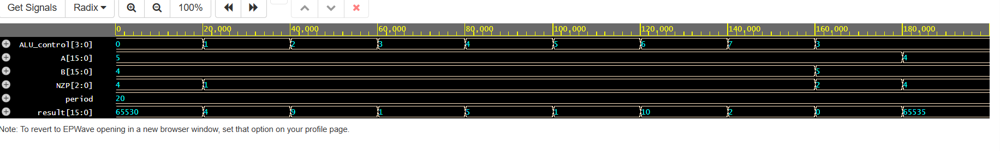
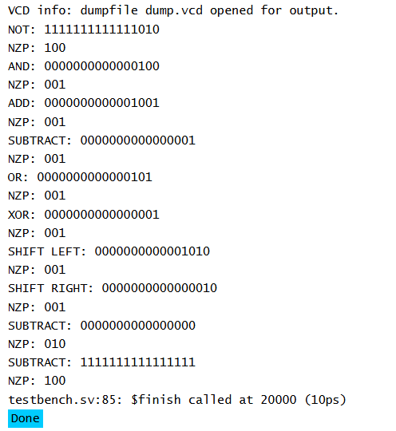

# 16-Bit-ALU

## Overview
This project implements a 16-bit Arithmetic Logic Unit (ALU) in SystemVerilog as part of a larger custom CPU design.

The ALU performs arithmetic, logical, and shift operations based on a 4-bit control signal. It also generates Negative, Zero, and Positive (NZP) condition codes from the result, which are used by the CPU's branch logic for conditional branching.

---

## Features
- 16-bit datapath
- Combinational RTL (`always_comb`)
- 4-bit ALU control
- Eight arithmetic, logical, and shift operations
- NZP (Negative, Zero, Positive) condition-code generation
- SystemVerilog simulation testbench

---

## Supported Operations
 - '0000' -> NOT A
 - '0001' -> AND
 - '0010' -> ADD
 - '0011' -> SUBTRACT
 - '0100' -> OR
 - '0101' -> XOR
 - '0110' -> SHIFT LEFT (A)
 - '0111' -> SHIFT RIGHT (A)

---

## Program Structure

src/
- ALU.sv

tb/ 
- ALU_tb.sv

---

## Simulation 

The 16-bit ALU was verified using a SystemVerilog testbench that tested all eight supported arithmetic, logical, and shift operations. Each test applied known input values and checked the resulting ALU output and NZP condition codes. Additional subtraction cases were included to verify positive (`001`), zero (`010`), and negative (`100`) condition-code generation.

The waveform below shows the ALU inputs, control signal, result, and NZP outputs throughout the simulation.

---

## Simulation Waveform

The waveform below shows the ALU being tested across its supported
operations using different 3-bit opcode values.

---

## Test Bench Results

The testbench verifies the expected output for each ALU operation.

## Improvements
- Carry flag
- Overflow detection
- Parameterized ALU width
- FPGA implementation

